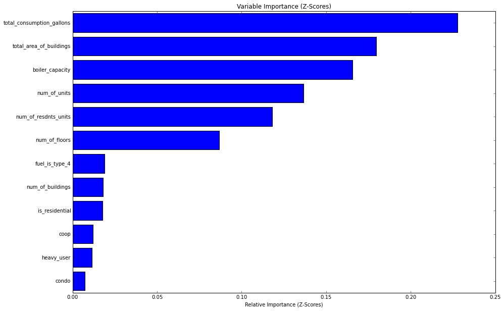

# Boilers of New York: Predicting the Age of a Building's Boiler Based on
Consumption, Size, and Major Features

Oil is much more expensive than it used to be.  My hypothesis (to make things
fun, I did zero research on boilers and any technological enhancements they may
or may not have experienced in the last 30 years) is that new boilers are much
more efficient than old boilers.  Let's test this theory, shall we?

First, let's get some data.  New York City's government wants to know which
buildings are burning oil for their heating/hot water needs, and they require
buildings with oil burning boilers to provide data on:

1. Total Area of all Buildings Supported by Boiler
2. Number of Separate Buildings Supported by Boiler
3. Number of Floors (total) Supported by Boiler
4. Number of Total Units
5. Number of Residential Units
6. Condominium Flag (yes/no)
7. Cooperative Flag (yes/no)
8. Primary Fuel Type (this differentiates between various fuel oil types.  This
dataset contains only #4 and #6 heating oil information.)
9. Boiler Capacity (the measurement of heat in BTUs the boiler is capable of
producing)
10. Total Consumption in Gallons
11. Boiler Installation Date (This is the variable we will be trying to predict.
Since the assignment is calling for Logistic Regression, we will convert this to
a discrete variable rather than a continuous one.  The idea is we just want to
know whether the boiler is older or newer than a certain data.  We will choose
1983 as our "cutoff" date for whether a boiler is "old" or not.  This is due to
1983 being at the 25th percentile of boiler installation dates.

The data is freely available [here](https://nycopendata.socrata.com/Housing-
Development/Oil-Boilers-Detailed-Fuel-Consumption-and-Building/jfzu-yy6n/about)

### Motivation

Most cities and localities don't collect information on building's energy
consumption at the level of detail that New York City does.  Being able to
predict any variable of this dataset based on various majore building features
could yield reliably preditive data to use in estimating fuel consumption,
average age of infrastructure, etc for other localities which lack the data that
New York City posesses.

### Low Hanging Fruit

Predicting the fuel consumption of a building based on features available here
is likely a straightforward and easy task.  There is a known linear relationship
between the size of a building and the energy required to heat it.

This is the reason why I have elected to go for the much more challenging task
of predicting the age of a building's boiler.  There is a strong chance that
data not present in this dataset, such as whether a building has been insulated
with modern methods, could be required to accurately predict boiler age as a
consumption of the provided variables.

    import pandas as pd
    import numpy as np
    import pylab as pl
    from scipy import stats
    
    #make all images a readable size
    from pylab import *
    rcParams['figure.figsize'] = 15, 10
    
    %pylab inline

    df = pd.read_csv('boiler_r.csv')

# Data Prep and Munging

    len(df[df.total_consumption_gallons > 300000])

    123

Here we see that there are some huge outliers here in terms of consumption.
Examination of the data shows that these are industrial users such as hospitals
and dormitories.  While these are certainly interesting pieces of data to have,
for the purposes of this work I'd like to exclude them.  After all, logistic
regression is math, not magic.

    df = df[df.total_consumption_gallons < 300000]

    df.building_type.unique()

    array(['Elevator Apartments', 'Walk-Up Apartments', 'Office Buildings',
           'Educational Structures', 'Loft Buildings', 'Condominiums',
           'Churches, Synagogues, etc.', 'Hotels', 'Warehouses',
           'Hospitals & Health', 'Factory & Industrial Buildings',
           'Asylums & Homes', 'Cultural & Public Assembly',
           'Transportation Facilities', 'Selected Government',
           'Store Buildings', 'Miscellaneous', 'Outdoor Recreation',
           'Utility Bureau', 'Residence - Multi-Use', 'Theatres',
           'Garages & Gasoline Stations', 'Vacant Land'], dtype=object)

Let's add a feature which marks out the specific building types which are normal
residences with a numeric 1.

    df['is_residential'] = df.building_type.str.contains('Elevator Apartments|Walk-Up Apartments|Condominiums|Residence - Multi-Use', 
                                                      na=False).astype(int)

    df.head()

<table border="1" class="dataframe">
  <thead>
    <tr style="text-align: right;">
      <th></th>
      <th>building_type</th>
      <th>total_area_of_buildings</th>
      <th>num_of_buildings</th>
      <th>num_of_floors</th>
      <th>num_of_resdnts_units</th>
      <th>num_of_units</th>
      <th>condo</th>
      <th>coop</th>
      <th>primary_fuel</th>
      <th>boiler_capacity</th>
      <th>total_consumption_gallons</th>
      <th>boiler_install_date</th>
      <th>boiler_year</th>
      <th>fuel_is_type_4</th>
      <th>heavy_user</th>
      <th>is_residential</th>
    </tr>
  </thead>
  <tbody>
    <tr>
      <th>24</th>
      <td> Elevator Apartments</td>
      <td>   35986</td>
      <td> 1</td>
      <td>  6</td>
      <td>  48</td>
      <td>  48</td>
      <td> 0</td>
      <td> 0</td>
      <td> #6</td>
      <td>  3.28</td>
      <td> 281853</td>
      <td> 1989</td>
      <td> 1</td>
      <td> 0</td>
      <td> 1</td>
      <td> 1</td>
    </tr>
    <tr>
      <th>25</th>
      <td> Elevator Apartments</td>
      <td> 1074489</td>
      <td> 2</td>
      <td> 42</td>
      <td> 871</td>
      <td> 872</td>
      <td> 0</td>
      <td> 1</td>
      <td> #6</td>
      <td> 21.00</td>
      <td> 280000</td>
      <td> 1984</td>
      <td> 1</td>
      <td> 0</td>
      <td> 1</td>
      <td> 1</td>
    </tr>
    <tr>
      <th>26</th>
      <td>  Walk-Up Apartments</td>
      <td>  421833</td>
      <td> 2</td>
      <td>  9</td>
      <td> 355</td>
      <td> 355</td>
      <td> 0</td>
      <td> 0</td>
      <td> #6</td>
      <td> 10.04</td>
      <td> 279882</td>
      <td> 2003</td>
      <td> 1</td>
      <td> 0</td>
      <td> 1</td>
      <td> 1</td>
    </tr>
    <tr>
      <th>27</th>
      <td> Elevator Apartments</td>
      <td>  254000</td>
      <td> 1</td>
      <td>  6</td>
      <td> 326</td>
      <td> 326</td>
      <td> 0</td>
      <td> 0</td>
      <td> #6</td>
      <td> 12.62</td>
      <td> 279225</td>
      <td> 1989</td>
      <td> 1</td>
      <td> 0</td>
      <td> 1</td>
      <td> 1</td>
    </tr>
    <tr>
      <th>28</th>
      <td>  Walk-Up Apartments</td>
      <td>  320157</td>
      <td> 1</td>
      <td>  4</td>
      <td> 360</td>
      <td> 360</td>
      <td> 0</td>
      <td> 0</td>
      <td> #6</td>
      <td> 12.62</td>
      <td> 262800</td>
      <td> 1989</td>
      <td> 1</td>
      <td> 0</td>
      <td> 1</td>
      <td> 1</td>
    </tr>
  </tbody>
</table>

The goal of this project is to utilize logistic regression.  This requires us to
bucket our boiler data into two different categories.  In this case, I'm
choosing old boilers vs. new boilers.

Because 1983 is at the 25th percentile for installation date, we will go ahead
and set it as the dividing date between old boilers and new boilers.

    def boiler_age(row): 
        if (row['boiler_install_date'] >= 1983): 
            return 1
        else:
            return 0
        
    df['boiler_year'] = df.apply(boiler_age,axis=1)

    fixed_col_names = ['building_type',
                         'total_area_of_buildings',
                         'num_of_buildings',
                         'num_of_floors',
                         'num_of_resdnts_units',
                         'num_of_units',
                         'condo',
                         'coop',
                         'primary_fuel',
                         'boiler_capacity',
                         'total_consumption_gallons',
                         'boiler_install_date',
                         'boiler_year',
                         'is_residential']

    df.columns = fixed_col_names

Let's create a flag to identify the remaining outlier users which consume more
than 74,000 gallons (they are above 75th percentile in usage).

    df['heavy_user'] = (df.total_consumption_gallons >= 74000).astype(int)

Convert the textual and sparse condo and coop flags into something numeric for
classification purposes.

    df.condo = df.condo.apply(lambda x: 1 if x == 'YES' else 0)
    df.coop = df.coop.apply(lambda x: 1 if x == 'YES' else 0)

Let's create an additional flag to identify users of #4 oil.

    df['fuel_is_type_4'] = (df.primary_fuel == '#4').astype(int)

    df.head()

<table border="1" class="dataframe">
  <thead>
    <tr style="text-align: right;">
      <th></th>
      <th>building_type</th>
      <th>total_area_of_buildings</th>
      <th>num_of_buildings</th>
      <th>num_of_floors</th>
      <th>num_of_resdnts_units</th>
      <th>num_of_units</th>
      <th>condo</th>
      <th>coop</th>
      <th>primary_fuel</th>
      <th>boiler_capacity</th>
      <th>total_consumption_gallons</th>
      <th>boiler_install_date</th>
      <th>boiler_year</th>
      <th>fuel_is_type_4</th>
      <th>heavy_user</th>
    </tr>
  </thead>
  <tbody>
    <tr>
      <th>24</th>
      <td> Elevator Apartments</td>
      <td>   35986</td>
      <td> 1</td>
      <td>  6</td>
      <td>  48</td>
      <td>  48</td>
      <td> 0</td>
      <td> 0</td>
      <td> #6</td>
      <td>  3.28</td>
      <td> 281853</td>
      <td> 1989</td>
      <td> 1</td>
      <td> 0</td>
      <td> 1</td>
    </tr>
    <tr>
      <th>25</th>
      <td> Elevator Apartments</td>
      <td> 1074489</td>
      <td> 2</td>
      <td> 42</td>
      <td> 871</td>
      <td> 872</td>
      <td> 0</td>
      <td> 1</td>
      <td> #6</td>
      <td> 21.00</td>
      <td> 280000</td>
      <td> 1984</td>
      <td> 1</td>
      <td> 0</td>
      <td> 1</td>
    </tr>
    <tr>
      <th>26</th>
      <td>  Walk-Up Apartments</td>
      <td>  421833</td>
      <td> 2</td>
      <td>  9</td>
      <td> 355</td>
      <td> 355</td>
      <td> 0</td>
      <td> 0</td>
      <td> #6</td>
      <td> 10.04</td>
      <td> 279882</td>
      <td> 2003</td>
      <td> 1</td>
      <td> 0</td>
      <td> 1</td>
    </tr>
    <tr>
      <th>27</th>
      <td> Elevator Apartments</td>
      <td>  254000</td>
      <td> 1</td>
      <td>  6</td>
      <td> 326</td>
      <td> 326</td>
      <td> 0</td>
      <td> 0</td>
      <td> #6</td>
      <td> 12.62</td>
      <td> 279225</td>
      <td> 1989</td>
      <td> 1</td>
      <td> 0</td>
      <td> 1</td>
    </tr>
    <tr>
      <th>28</th>
      <td>  Walk-Up Apartments</td>
      <td>  320157</td>
      <td> 1</td>
      <td>  4</td>
      <td> 360</td>
      <td> 360</td>
      <td> 0</td>
      <td> 0</td>
      <td> #6</td>
      <td> 12.62</td>
      <td> 262800</td>
      <td> 1989</td>
      <td> 1</td>
      <td> 0</td>
      <td> 1</td>
    </tr>
  </tbody>
</table>

# Initial Visualizations

    homes = df.is_residential == 1
    other_use = df.is_residential == 0

    plot(df[homes].num_of_units, df[homes].total_consumption_gallons, 'bo', label = 'Residential')
    plot(df[other_use].num_of_units, df[other_use].total_consumption_gallons, 'ro', label= 'Other')
    plt.title('Total Oil Consumption in Gallons for Various NYC Buildings')
    plt.xlabel('Number of Units')
    plt.ylabel('Gallons of Oil')
    plt.legend()

    <matplotlib.legend.Legend at 0x1156eb790>

    plot(df[homes].num_of_floors, df[homes].total_consumption_gallons, 'bo', label = 'Residential')
    plot(df[other_use].num_of_floors, df[other_use].total_consumption_gallons, 'ro', label= 'Other')
    plt.title('Total Oil Consumption in Gallons vs. Number of Floors for Various NYC Buildings')
    plt.xlabel('Number of Floors')
    plt.ylabel('Gallons of Oil')
    plt.legend()

    <matplotlib.legend.Legend at 0x117342d50>

    df.boiler_install_date.hist()
    plt.title('NYC Boiler Installation Years - Histogram')
    plt.xlabel('Boiler Installation Year')
    plt.ylabel('Number of Boilers')

    <matplotlib.text.Text at 0x11494b210>

#Feature Engineering

##Finding Important Features
We're going to let scikit-learn help us determine which variables are the best
at predicting boiler age. We are going to utilize RandomForest models to test
out which variables are more important than others for predicting whether a
building's boiler was built before or after 1983. (The boiler_year variable)

    from sklearn.ensemble import RandomForestClassifier

    features = np.array(['total_area_of_buildings',
                 'num_of_buildings',
                 'num_of_floors',
                 'num_of_resdnts_units',
                 'num_of_units',
                 'condo',
                 'coop',
                 'boiler_capacity',
                 'total_consumption_gallons',
                 'fuel_is_type_4',
                 'heavy_user',
                 'is_residential'])

For simplicity's sake, we're only going to use the numeric variables.  The
primary fuel seems to be between #4 and #6 heating oil.  Not a big difference.

Additionally, the building type really isn't important, since we have numerical
data indicating

    *Number of buildings
    *Number of floors
    *Number of residential units

In other words, high rises, residential, commercial/office, etc can be
identified numerically.

    rf_classifier = RandomForestClassifier(compute_importances=True)
    rf_classifier.fit(df[features], df['boiler_year'])

    /Users/johnkabler/anaconda/lib/python2.7/site-packages/sklearn/ensemble/forest.py:783: DeprecationWarning: Setting compute_importances is no longer required as version 0.14. Variable importances are now computed on the fly when accessing the feature_importances_ attribute. This parameter will be removed in 0.16.
      DeprecationWarning)

    RandomForestClassifier(bootstrap=True, compute_importances=None,
                criterion='gini', max_depth=None, max_features='auto',
                min_density=None, min_samples_leaf=1, min_samples_split=2,
                n_estimators=10, n_jobs=1, oob_score=False, random_state=None,
                verbose=0)

    importances = rf_classifier.feature_importances_

    sorted_idx = np.argsort(importances)

    padding = np.arange(len(features)) + 0.5
    pl.barh(padding, importances[sorted_idx], align='center')
    pl.yticks(padding, features[sorted_idx])
    pl.xlabel("Relative Importance")
    pl.title("Variable Importance")
    pl.show()

### Data Normalization

We have data which is captured in dramatically differring units.

Let's try running this after normalizing the data with the Z score function from
scipy.

    norm_df = df[features].copy()

    col_names = norm_df.columns.tolist()

    col_names

    ['total_area_of_buildings',
     'num_of_buildings',
     'num_of_floors',
     'num_of_resdnts_units',
     'num_of_units',
     'condo',
     'coop',
     'boiler_capacity',
     'total_consumption_gallons',
     'fuel_is_type_4',
     'heavy_user',
     'is_residential']

    z_df = stats.zscore(norm_df)

    z_df = pd.DataFrame(z_df)

    z_df.columns = col_names

    rf_classifier.fit(z_df[features], df['boiler_year'])
    importances = rf_classifier.feature_importances_
    sorted_idx = np.argsort(importances)
    
    padding = np.arange(len(features)) + 0.5
    pl.barh(padding, importances[sorted_idx], align='center')
    pl.yticks(padding, features[sorted_idx])
    pl.xlabel("Relative Importance (Z-Scores)")
    pl.title("Variable Importance (Z-Scores)")
    pl.show()

## Results of feature importance testing:

Intuitively, it makes sense why the 3 top variables are the total consumption of
fuel, total area, and the boiler capacity.  Based on the assumption that boilers
built after 1980 are more efficient than those built before, it would make sense
that predicting a boiler's age is a function of total consumption, building
area, and boiler capacity.  My guess is that a newer boiler will use less total
fuel for the same given area and capacity.

We'll see.

    # let's just pick the best variables 
    clean_df = z_df[['total_consumption_gallons', 'total_area_of_buildings', 'boiler_capacity', 'num_of_units', 
                     'num_of_resdnts_units', 'num_of_floors']].copy()

Based on the random forest classifier's output, we've now chosen the top 6
variables to use to predict whether a building's boiler was installed before or
after 1983.

# Enough on the features, Let's start our Logistic Regression

Student has run a logistic regression on the dataset (50pts)

   * A fitted logistic regression model must be created.
   * Output including coefficient values, standard errors, and residuals should
be generated.
   * The student must be able to push new data points through the model to get
regression scores.
   * The model results must be reproducible (i.e. for all steps requiring some
random aspect, a suitable random seed was set).

### Parameter Optimization using Grid Search

Before we start fitting a Logistic Regression model, let's ensue we use optimal
parameters.  First, we are also going to use GridSearch to optimize the logistic
regression classifier's parameters (mainly C).  Let's import everything we need.

    from sklearn.linear_model import LogisticRegression
    from sklearn import grid_search

    X = clean_df
    Y = df.boiler_year
    classifier = LogisticRegression()

Here we create and run the grid search on our logistic regression classifier.
We are using the grid search to test for the best values to use for both the 'C'
parameter and the 'penalty' parameter.

    parameters = {'penalty': ('l1', 'l2'),'C':[.7, .8, .9, 1.0]}
    grid_class = grid_search.GridSearchCV(classifier, parameters)
    grid_class.fit(X,Y)

    GridSearchCV(cv=None,
           estimator=LogisticRegression(C=1.0, class_weight=None, dual=False, fit_intercept=True,
              intercept_scaling=1, penalty='l2', random_state=None, tol=0.0001),
           fit_params={}, iid=True, loss_func=None, n_jobs=1,
           param_grid={'penalty': ('l1', 'l2'), 'C': [0.7, 0.8, 0.9, 1.0]},
           pre_dispatch='2*n_jobs', refit=True, score_func=None, scoring=None,
           verbose=0)

After running the grid search cross validator, we can examine the optimal
parameters the GridSearchCV function has identified.

    grid_class.best_params_

    {'C': 0.7, 'penalty': 'l2'}

Our best parameters are a C value of .7 and a penalty (or regularization
function) of 'l2'.

    grid_class.best_score_

    0.75573748490135551

Here we see that the best score achieved is 75%.  This isn't particularly great,
since guessing "new boiler" randomly would give us a 75% accuracy.  I'm
beginning to suspect that the initial hypothesis of being able to detect a
building's boiler age based on its fuel usage and other features such as raw
area and number of units and floors is completely wrong.

A likely reason for this is that many landlords/owners would simply opt to
achieve efficiency with better insulation rather than replacing a boiler.

## Logistic Regression using Optimized Parameters

First, let's go ahead and recreate our classifier with the recommended (optimal)
parameters identified by the GridSearchCV function.

    classifier = LogisticRegression(C= 0.7, penalty='l2')

### Cross Validation

Let's use KFold cross validation to ensure we are adequately testing our model
on data it wasn't trained on.

Lets create a KFold cross validation process for our newly tailored classifier,
and then we'll excecute it.

    from sklearn.cross_validation import KFold
    
    
    k_fold = KFold(n=len(X), n_folds=15, indices=False)
    scores = []
    
    
    for train_indices, test_indices in k_fold:
        train_x = X[train_indices]
        train_y = Y[train_indices]
    
        test_x = X[test_indices]
        test_y = Y[test_indices]
    
    #     grid_class.fit(train_text, train_y)
    #     score = grid_class.score(test_text, test_y)
        classifier.fit(train_x, train_y)
        score = classifier.score(test_x, test_y)
        scores.append(score)
        
    score = sum(scores) / len(scores)
    print(score)

    0.755600809156

Our average score with cross validation was 75%.

Below we see the array of scores we achieved with out various folds.

    scores

    [0.77665995975855129,
     0.78873239436619713,
     0.74044265593561365,
     0.73843058350100599,
     0.75653923541247481,
     0.75855130784708247,
     0.73843058350100599,
     0.77263581488933597,
     0.74044265593561365,
     0.75452716297786715,
     0.76458752515090544,
     0.77217741935483875,
     0.76209677419354838,
     0.75403225806451613,
     0.71572580645161288]

# Surveying the Disaster Area

1) Why is accuracy no better than chance?

   * To figure this out, let's plot the ROC curve

    from sklearn.utils import shuffle
    from sklearn.metrics import roc_curve, auc
    
    random_state = np.random.RandomState(0)
    
    
    n_samples, n_features = X.shape
    
    
    X, Y = shuffle(X, Y, random_state=random_state)
    half = int(n_samples / 2)
    X_train, X_test = X[:half], X[half:]
    Y_train, Y_test = Y[:half], Y[half:]
    
    
    probas_ = classifier.fit(X_train, Y_train).predict_proba(X_test)
    
    # Compute ROC curve and area the curve
    fpr, tpr, thresholds = roc_curve(Y_test, probas_[:, 1])
    roc_auc = auc(fpr, tpr)
    print "Area under the ROC curve : %f" % roc_auc
    
    # Plot ROC curve
    pl.clf()
    pl.plot(fpr, tpr, label='ROC curve (area = %0.2f)' % roc_auc)
    pl.plot([0, 1], [0, 1], 'k--')
    pl.xlim([0.0, 1.0])
    pl.ylim([0.0, 1.0])
    pl.xlabel('False Positive Rate')
    pl.ylabel('True Positive Rate')
    pl.title('Receiver operating characteristic example')
    pl.legend(loc="lower right")
    pl.show()

    Area under the ROC curve : 0.632521

## Conclusion

While there is nothing stellar going on here, the good news is that we are
performing better than random guessing.

The conclusion here is this:  Basic variables of a building's footprint,
including total area and number of units, combined with the amount of oil
required to heat it, isn't sufficient to predict the age of the building's
boiler.

As I said before, I have yet to research whether the efficiency of boilers has
increased much in the past 30 years.  My conclusion based on this data is that
boilers have not increased much in efficiency, but rather that building
efficiency increases are based on other factors, such as insulation and HVAC
based control systems.

# Next Steps

While the purpose of this exercise was to challenge myself with a likely
unpredictable variable (with the given data), I think this dataset could be
extremely useful when utilized in a different, and much more obvious way:
Predicting the oil consumption of a building based on features such as square
footage, number of floors, number of separate buildings, etc.

This would be a useful project to help a researcher estimate the total fuel
consumption of a given neighborhood, based only on simple data obtained from
historical building permits and other readily available data sources.
